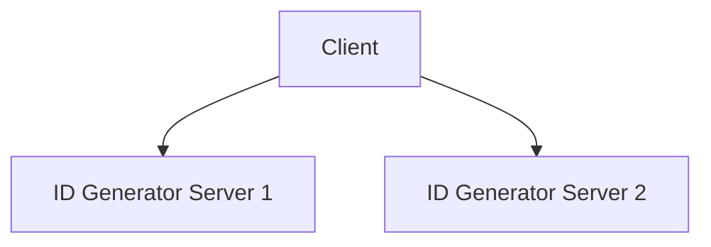
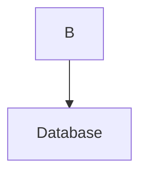
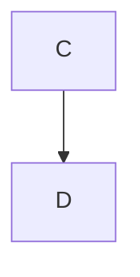

# Design

We use a Snowflake-like approach for v3.

```mermaid
graph TD
    A[Client] --> B[ID Generator Server 1]
    A --> C[ID Generator Server 2]
```

```mermaid
graph TD
    B --> D[Database]
```

```mermaid
graph TD
    C --> D
```
